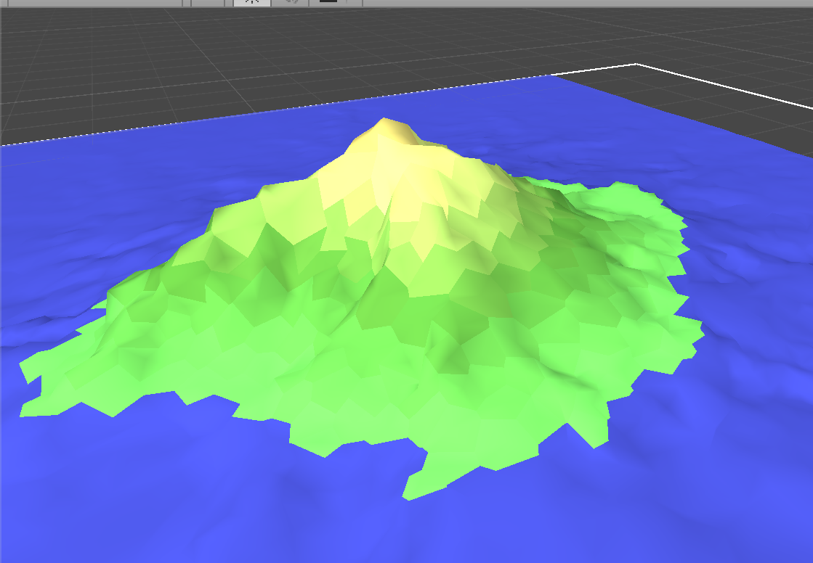
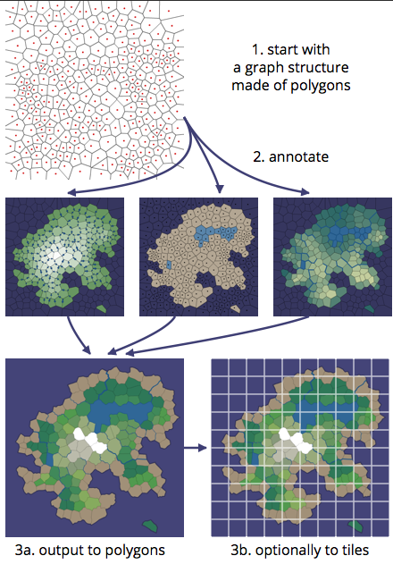

# ProcgenIsland
Procedurally Generated Island in Unity using map rules

# How it works
I wanted to generate interesting game maps that weren’t constrained to be realistic, and I wanted to try some techniques I hadn’t tried before. I usually make tile maps but instead used a different structure. What could I do with 1,000 polygons instead of 1,000,000 tiles? The distinct player-recognizable areas might be useful for gameplay: locations of towns, places to quest, territory to conquer or settle, landmarks, pathfinding waypoints, difficulty zones, etc. I generated maps with polygons, then rasterized them into tile maps that looked like this:

  

Most procedural map generators, including some of my own previous projects, use noise functions (simplex noise, midpoint displacement, fractal, diamond-square, perlin noise, etc.) to generate a height map. I did not do that here. Instead, I used a graph structure to model the things directed by gameplay constraints (elevation, roads, river flow, quest locations, monster types) and noise functions to model the variety not constrained by gameplay (coastline shape, river placement, tree placement).

  

There were three main things I wanted for this project: good coastlines, mountains, and rivers. For the coastline, I wanted to make island maps that are surrounded by ocean, so that I don’t have to deal with people walking to the edge of the map. For the mountains, I started with something simple: mountains are whatever’s farthest from the coastline, so that you can always walk uphill to reach the top. For the rivers, I started with something simple: draw rivers from the coast to the mountains, so that you can always follow rivers down to the beach.

